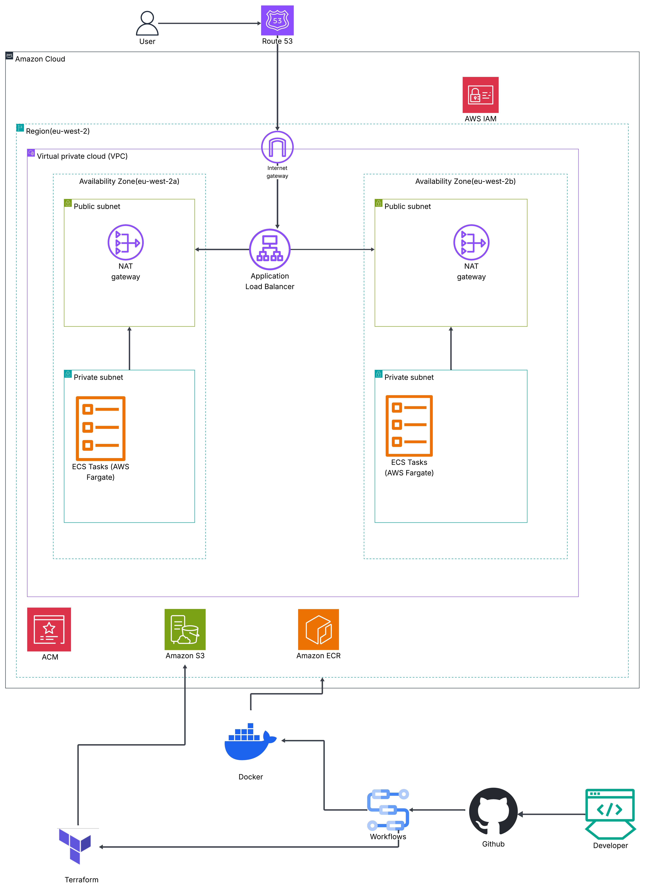
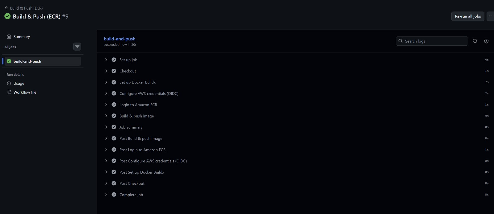
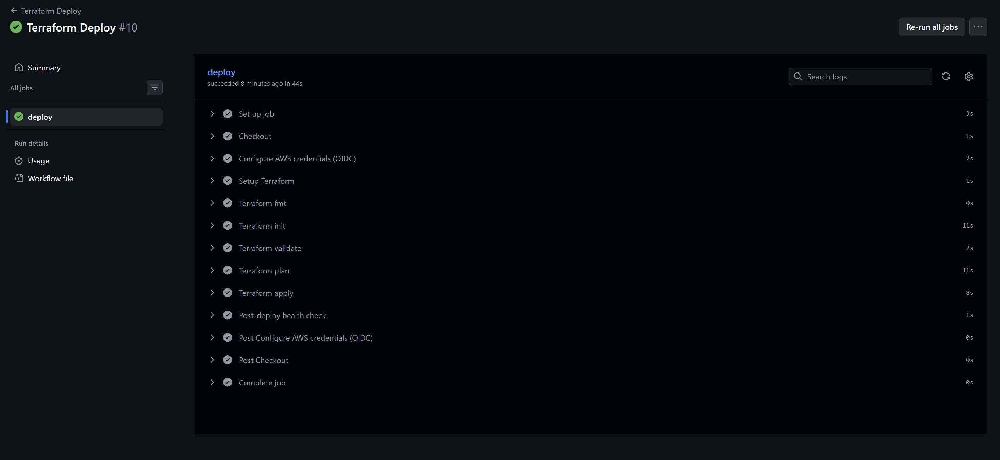
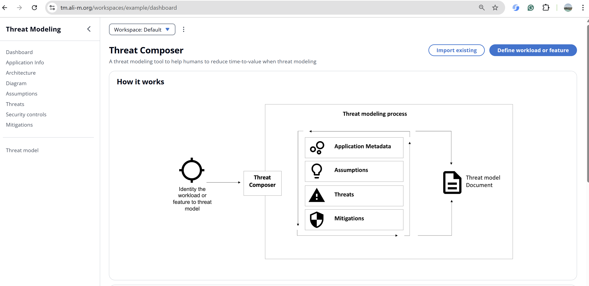

# ECS Threat Composer Deployment

This project demonstrates a production-style container deployment on **AWS ECS Fargate** using **Docker, Terraform, and GitHub Actions CI/CD**.

The application is deployed behind an **Application Load Balancer with HTTPS**, uses **Amazon ECR for container images**, and is fully provisioned with **Infrastructure as Code (Terraform)**.

The final application is accessible through a custom domain using **Route53 and ACM TLS certificates**.

---

# Overview

This project focuses on the following DevOps practices:

- Containerising a web application using Docker
- Infrastructure provisioning using Terraform
- CI/CD pipelines using GitHub Actions
- Secure authentication to AWS using OIDC (no static credentials)
- HTTPS configuration using AWS Certificate Manager
- Automated deployments to AWS ECS Fargate

The goal is to demonstrate a **fully automated deployment pipeline for a containerised application on AWS**.

---

# Architecture

The infrastructure is deployed in AWS using a **highly available VPC architecture across two Availability Zones**.

The application runs on **ECS Fargate in private subnets**, while traffic is routed through an **Application Load Balancer in public subnets**.

User requests are routed through **Route53 DNS** and secured using **HTTPS with ACM certificates**.

---

# Architecture Diagram



---

# Repository Structure

```
.
├── app/                     
│
├── Dockerfile               
├── nginx.conf               
│
├── infra/                   
│   ├── backend.tf
│   ├── main.tf
│   ├── variables.tf
│   └── modules/
│       ├── vpc/
│       ├── security/
│       ├── alb/
│       ├── ecs/
│       └── ecr/
│
├── .github/workflows/       
│   ├── build.yaml
│   └── deploy.yaml
│
├── README.md
└── .gitignore
```

---

# Containerisation

The application is packaged into a **Docker container**.

The container is built using a **multi-stage Docker build**:

1. Node.js builds the frontend application  
2. Nginx serves the static build output  

Build locally:

```bash
docker build -t threat-composer .
```

Run locally:

```bash
docker run -p 8080:80 threat-composer
```

Verify:

```bash
curl http://localhost:8080
```

---

# Image Registry (Amazon ECR)

Container images are stored in **Amazon Elastic Container Registry (ECR)**.

The GitHub Actions pipeline automatically:

- Builds the Docker image
- Tags it with the **Git commit SHA**
- Pushes it to **ECR**

Example image tag:

```
<account-id>.dkr.ecr.<region>.amazonaws.com/ecs-threat:<commit-sha>
```

---

# Infrastructure as Code (Terraform)

Infrastructure is provisioned using **Terraform modules**.

Main components deployed:

- VPC
- Public and Private Subnets
- Internet Gateway
- NAT Gateway
- Security Groups
- Application Load Balancer
- ECS Cluster
- ECS Service (Fargate)
- ECR Repository
- Route53 DNS Record
- ACM TLS Certificate

Terraform commands used:

```bash
terraform init
terraform plan
terraform apply
```

Destroy infrastructure:

```bash
terraform destroy
```

---

# CI/CD Automation (GitHub Actions)

Two CI/CD pipelines are implemented.

---

## Build & Push Pipeline

Triggered on push to `main` when application files change.

Steps:

1. Checkout repository  
2. Build Docker image  
3. Authenticate to AWS using **OIDC**  
4. Push container image to **Amazon ECR**



---

## Terraform Deploy Pipeline

Triggered on push to `main` when infrastructure changes.

Steps:

1. Configure AWS credentials via **OIDC**
2. Terraform init
3. Terraform validate
4. Terraform plan
5. Terraform apply
6. Post-deployment health check

Health check:

```bash
curl https://tm.<your-domain>/health
```

If the endpoint is unhealthy, the pipeline fails.



---

# HTTPS and Domain

The application is accessible through a **custom domain secured with HTTPS**.

Components used:

- Route53 → DNS record for subdomain
- ACM → TLS certificate
- ALB HTTPS listener

HTTP traffic is automatically redirected to HTTPS.

Final URL:

```
https://tm.<your-domain>
```

Example:

```
https://tm.ali-m.org
```

---

# Live Deployment

The deployed application can be accessed at:

```
https://tm.<your-domain>
```



---

# How to Reproduce

## Requirements

- AWS Account
- Terraform
- Docker
- GitHub account
- Domain configured in Route53

---

## 1. Clone Repository

```bash
git clone https://github.com/<your-username>/ecs-threat-composer.git
cd ecs-threat-composer
```

---

## 2. Configure AWS

Ensure AWS CLI is configured.

```bash
aws sts get-caller-identity
```

---

## 3. Deploy Infrastructure

```bash
cd infra
terraform init
terraform apply
```

---

## 4. Build Container

```bash
docker build -t threat-composer .
```

---

## 5. Push to ECR

Authenticate Docker:

```bash
aws ecr get-login-password --region <region> \
| docker login --username AWS --password-stdin <account-id>.dkr.ecr.<region>.amazonaws.com
```

Push image:

```bash
docker push <repo-url>
```

---

# Challenges and Lessons Learned

During this project several challenges were encountered:

- Handling Terraform resource dependencies
- Configuring ECS tasks inside private subnets
- Setting up GitHub Actions OIDC authentication
- Implementing reliable health checks in CI/CD pipelines

These challenges helped improve understanding of **AWS infrastructure automation and production deployment patterns**.

---

# Future Improvements

Possible enhancements include:

- Blue/Green deployments
- ECS auto-scaling policies
- AWS WAF integration
- CloudWatch monitoring and alarms
- Secrets management using AWS Secrets Manager

---